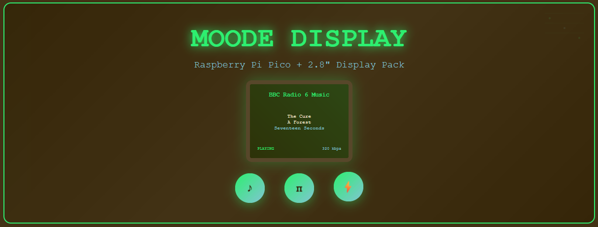

# Moode Audio Display for Pico Display Pack 2.8"

A MicroPython-based display client that shows now-playing information from a Moode Audio system on a Raspberry Pi Pico with the Pimoroni Pico Display Pack 2.8".


This is a standalone wireless display that shows what's currently playing on your Moode Audio system. The display connects to any Moode installation running elsewhere on your network and presents the current track or radio station in a clean, readable format.

The project was created primarily for radio listening - it displays the station name prominently and, when available, shows the current track information. For stations that don't provide track details, the display simply shows "Listening to Radio" so you always know it's working.

Power management is built-in: the display automatically sleeps when music stops to preserve the screen and save energy. Whilst sleeping, it checks for activity every 15 seconds, then switches to 5-second updates when music resumes. You can easily adjust these intervals in the code if needed.Text wrapping ensures nothing gets cut off, longer station names and track titles automatically flow to multiple lines. 

The project uses Pimoroni's bitmap8 font by default, though other font options are available if you prefer a different look.

The Pico Display Pack includes tactile buttons, but they're not used in this version - the focus is purely on displaying information clearly and efficiently.

Thanks for checking out the project! Also see my numpad moode audio controller: https://github.com/mlake1/moode-numpad-controller

## Features

- **Real-time display** of currently playing music from Moode Audio
- **Smart power management** - display sleeps when music is stopped
- **Adaptive layout** for different content types:
  - Radio stations with station name and current track
  - Music files with title, artist, and album information
- **Status indicators** - playing/paused/stopped states
- **Bitrate display** - shows audio quality information
- **Automatic text wrapping** for long titles and station names
- **WiFi connectivity** with connection status feedback
- **Memory optimisation** for stable long-term operation

## Hardware Requirements

- [Raspberry Pi Pico W](https://shop.pimoroni.com/products/raspberry-pi-pico-w)
- [Pimoroni Pico Display Pack 2.8"](https://shop.pimoroni.com/products/pico-display-pack-2-8?variant=42047194005587)
- [Moode Audio](https://moodeaudio.org/) system running on a seperate device elsewhere on the network

## Software Requirements

- MicroPython firmware on the Pico W
- Pimoroni MicroPython libraries (PicoGraphics)

## Installation

1. **Flash MicroPython** to your Pico W with Pimoroni libraries:
   - Download the latest Pimoroni MicroPython firmware from [releases](https://github.com/pimoroni/pimoroni-pico/releases)
   - Flash it to your Pico W using your preferred method

2. **Create secrets.py** file with your network configuration:
   ```python
   # WiFi credentials
   WIFI_SSID = "your_network_name"
   WIFI_PASSWORD = "your_wifi_password"
   
   # Moode device IP address
   MOODE_IP = "192.168.1.100"  # Replace with your Moode's static IP
   ```

3. **Upload files** to your Pico W:
   - `main.py` (the main display code)
   - `secrets.py` (your configuration file)

4. **Connect hardware**:
   - Attach the Pico Display Pack 2.8" to your Pico W
   - Power on the device

## Configuration

### Finding Your Moode IP Address
You can find your Moode Audio system's IP address by:
- Checking your router's admin panel
- Using the Moode web interface (System > System Config)
- Running `hostname -I` on the Moode system via SSH

### Setting a Static IP (Recommended)
For reliable operation, set a static IP for your Moode system:
1. Access Moode's web interface
2. Go to Configure → Network
3. Set a static IP address
4. Update `MOODE_IP` in your `secrets.py` file

## Display Layout

### Radio Stations
- **Top**: Station name (large, green text)
- **Middle**: Current track info or "Listening to Radio" message
- **Bottom Left**: Play status (PLAYING/PAUSED/STOPPED)
- **Bottom Right**: Bitrate information

### Music Files
- **Top**: Song title (large, white text)
- **Middle**: Artist name (green) and album (blue)
- **Bottom Left**: Play status
- **Bottom Right**: Bitrate information

## Power Management

The display automatically:
- **Sleeps** when music is stopped (turns off backlight and shows minimal info)
- **Wakes** when music starts playing
- **Updates** every 5 seconds when active, 15 seconds when sleeping
- **Optimises memory** usage for stable long-term operation

## Troubleshooting

### Connection Issues
- Verify WiFi credentials in `secrets.py`
- Ensure Moode IP address is correct and reachable
- Check that Moode's web interface is accessible from your network

### Display Issues
- Ensure MicroPython firmware includes Pimoroni libraries
- Check that the Display Pack is properly seated on the Pico W
- Try restarting the device

### Memory Issues
- The code includes garbage collection to prevent memory leaks
- If you experience crashes, try reducing the update frequency

## API Endpoint

This project uses Moode Audio's built-in API endpoint:
```
GET /command/?cmd=get_currentsong
```

The response includes:
- Track title, artist, album information
- Playback state (play/pause/stop)
- Audio format and bitrate
- Radio station metadata

## Customisation

### Colours
Colours are defined at the top of `main.py` and can be easily modified:
```python
GREEN = display.create_pen(0, 255, 0)
BLUE = display.create_pen(0, 150, 255)
# Add your own colours here
```

### Update Intervals
Modify the sleep times in the main loop:
```python
if display_is_on:
    time.sleep(5)    # Active update interval
else:
    time.sleep(15)   # Sleep check interval
```

### Text Wrapping
Adjust `max_chars` values in the `display_song_info()` function to change how text is wrapped for different screen elements.

## Contributing

Feel free to submit suggestions, issues and pull requests!

## License

This project is open source. Please check the licenses of the dependencies (MicroPython, Pimoroni libraries) for their respective terms.

## Acknowledgments

- [Moode Audio](https://moodeaudio.org/) Thanks to Tim and everyone else @ Moode for the fantastastic software

## Hardware Safety
This project involves electronic components. Users assume all responsibility
for proper assembly, electrical safety, and hardware protection.

## Warranty Disclaimer
This program is distributed in the hope that it will be useful,
but WITHOUT ANY WARRANTY; without even the implied warranty of
MERCHANTABILITY or FITNESS FOR A PARTICULAR PURPOSE. See the
GNU General Public License for more details.

## Licence
This project is licenced under the GNU General Public License v3.0.
See the [LICENCE](LICENCE) file for details.